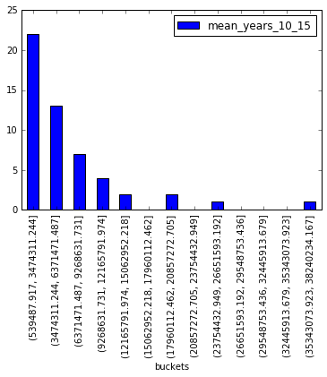
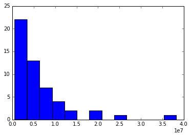

```python
import pandas as pd
import numpy as np
import matplotlib.pyplot as plt
%matplotlib inline 

```


```python
population_dataset = pd.read_csv("NST-EST2015-alldata.csv")
```


```python
result_df = population_dataset[ (population_dataset['SUMLEV'] == 40)].sort_values('POPESTIMATE2015', ascending=False)
```


```python
result_df['mean_years_10_15'] = result_df[['POPESTIMATE2015', 'POPESTIMATE2014', 'POPESTIMATE2013', 'POPESTIMATE2012', 'POPESTIMATE2011', 'POPESTIMATE2010']].mean(axis=1)
```


```python
result_df['buckets'] = pd.cut(np.array(result_df['mean_years_10_15']), 13)
```


```python
res_newdf = result_df[['buckets','mean_years_10_15']].groupby('buckets').count()

```


```python
res_newdf.plot(kind='bar')
```


    <matplotlib.axes._subplots.AxesSubplot at 0x7f25a41e4550>





```python
plt.hist(result_df['mean_years_10_15' ], bins=13)
```


    (array([ 22.,  13.,   7.,   4.,   2.,   0.,   2.,   0.,   1.,   0.,   0.,
              0.,   1.]),
     array([   577151.        ,   3474311.24358974,   6371471.48717949,
              9268631.73076923,  12165791.97435897,  15062952.21794872,
             17960112.46153846,  20857272.7051282 ,  23754432.94871795,
             26651593.19230769,  29548753.43589744,  32445913.67948718,
             35343073.92307692,  38240234.16666666]),
     <a list of 13 Patch objects>)





```python
np.histogram(result_df['mean_years_10_15' ], bins=13)
```


    (array([22, 13,  7,  4,  2,  0,  2,  0,  1,  0,  0,  0,  1]),
     array([   577151.        ,   3474311.24358974,   6371471.48717949,
              9268631.73076923,  12165791.97435897,  15062952.21794872,
             17960112.46153846,  20857272.7051282 ,  23754432.94871795,
             26651593.19230769,  29548753.43589744,  32445913.67948718,
             35343073.92307692,  38240234.16666666]))


